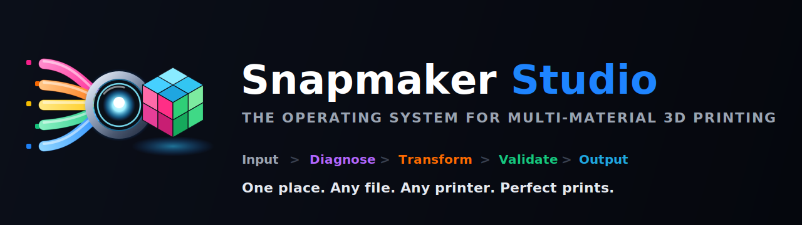
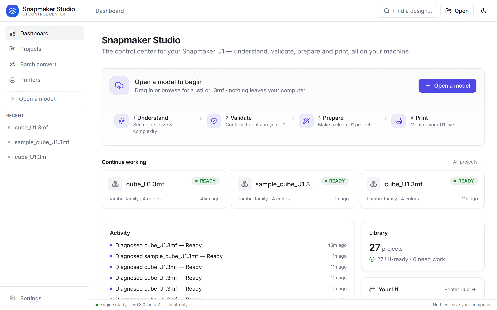
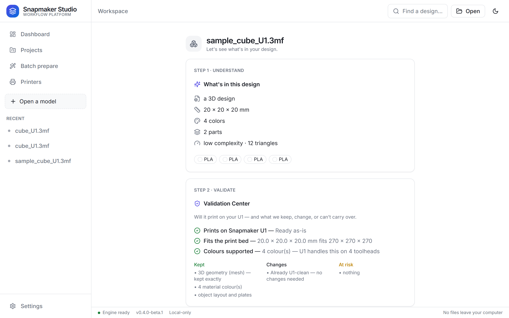
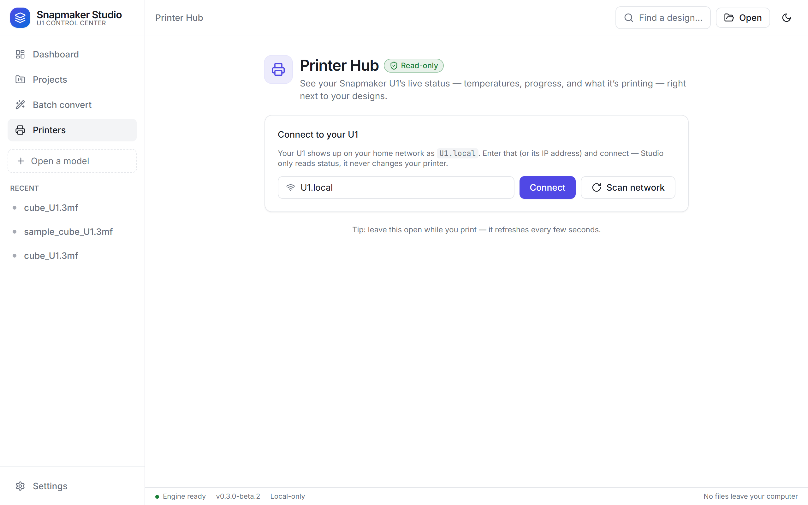

<p align="center"></p>

# Snapmaker Studio


**The workflow platform for modern 3D printing.**

_Understand any design, check if it will print, get it ready — and watch your printer do it._

Snapmaker Studio is a friendly, local-first desktop app (plus a scriptable engine
and CLI) that takes a 3D design from **any** common source and walks it through the
whole pre-print workflow:

1. **Understand** — see colors, size, complexity and which ecosystem it came from, in plain language.
2. **Validate** — find out whether it will print, and exactly what's preserved, changed, or at risk.
3. **Prepare** — make a clean, print-ready copy. Your originals are never changed.
4. **Monitor** — watch your printer's live status while it prints (read-only).

Runs entirely on your machine. No cloud, no account, no upload — local-first and
open source.

> **Independent open-source project — not affiliated with or endorsed by Snapmaker.**
> Validated on a real-world Bambu/Orca corpus — **112 files → 100% U1-ready**
> (see [PROOF.md](PROOF.md)). More context:
> [`docs/PRODUCT_VISION.md`](docs/PRODUCT_VISION.md) ·
> [`docs/ARCHITECTURE.md`](docs/ARCHITECTURE.md) · [`docs/ROADMAP.md`](docs/ROADMAP.md) ·
> [`docs/INNOVATION_FUND.md`](docs/INNOVATION_FUND.md) ·
> landing [`docs/landing/index.html`](docs/landing/index.html).

## Download

**[⬇ Download the latest Windows installer](https://github.com/DeadlyVirusIn/snapmaker-studio/releases/latest)**
— one click, no Python, runs offline. (Beta — Windows 10/11 x64.)

Open the downloaded `…_x64-setup.exe`, install, and launch **Snapmaker Studio**.
No account, no cloud, nothing leaves your computer. Older builds and checksums are
on the [Releases page](https://github.com/DeadlyVirusIn/snapmaker-studio/releases).

## Screenshots

The desktop app — local-first, dark-first. The whole workflow in one place:
**Understand → Validate → Prepare → Monitor**.

| Dashboard | Design Insights |
|---|---|
|  |  |
| **Validation Center** | **Printer Hub (read-only)** |
|  |  |

## Why

Designs from popular slicers and model sites don't always open cleanly on a given
printer — and novices often can't tell *why*, or whether a file will even print.
Snapmaker Studio closes that gap: open any design and get a plain-language read on
what's in it, a readiness check, and a clean print-ready copy — without losing
detail, painted regions, or multi-color assignments. The Snapmaker U1 is the first
printer target; the workflow is built to grow across ecosystems.

## What's inside

- **Project Intelligence** — real, read-only design data: dimensions, triangle count
  and complexity, detected materials/colors, object and plate counts, and the source
  ecosystem. No guesswork, no fake data.
- **Validation Center** — a readiness check that answers the questions a novice
  actually has: *will it print, what's preserved, what changes, and what's at risk?*
- **Prepare** — make a clean, validated print-ready copy in one click. Originals are
  never overwritten; every change is recorded.
- **Printer Hub (read-only)** — discover a networked Snapmaker U1 over its open,
  LAN-trusted interface and watch live status: print state, progress, bed and
  toolhead temperatures. **Monitoring only** — no upload, no print start, no printer
  changes.
- **Design Library** — everything you open is checked, scored, and kept with its full
  history, so you always know what's ready.
- **Engine + CLI** — the same workflow as a pure-Python engine and `u1convert` CLI for
  scripting and automation.

## What makes it different

- **Design-first and novice-friendly.** It explains a design in plain language and
  tells you whether it will print — before you ever open a slicer.
- **Local-first.** Everything runs on your machine. No cloud, no account, no upload.
- **Multi-ecosystem foundation.** Bambu, OrcaSlicer, and plain STL are first-class
  today; PrusaSlicer files are *detected* (full preservation is on the roadmap). The
  engine is built around a source-neutral model so more ecosystems can follow.
- **Preservation-first.** Geometry, painting, and color are kept faithfully. Studio
  never silently drops colors or detail — and when it can't guarantee a faithful
  result, it stops and tells you why.
- **Open printer opportunity.** The U1 runs open, LAN-trusted firmware, which is what
  makes read-only monitoring (and a future, opt-in control layer) possible.

## Compatibility

| Input | Status | Result |
|---|---|---|
| Bambu / Orca `.3mf` project | ✅ supported | print-ready Snapmaker U1 `.3mf` |
| `.stl` model | ✅ supported | print-ready Snapmaker U1 `.3mf` |
| PrusaSlicer `.3mf` | 🚧 detected | read & understood; full conversion planned |
| `.obj` / `.glb` | 🚧 planned | — |

First printer target: **Snapmaker U1**. Open the result in Snapmaker Orca to slice
and print. More printer targets are planned — see the [roadmap](docs/ROADMAP.md).

## Quick start (30 seconds)

Most people just install the desktop app (above). For scripting, the engine ships a
CLI. Install from source (PyPI package coming later):

```bash
pip install -e backend
```

Then, using the bundled example:

```bash
# Understand any file first — read-only, never modifies it
u1convert doctor examples/sample_cube_U1.3mf

# Get a plain STL print-ready for the U1
u1convert repair examples/sample_cube.stl -o my_part_U1.3mf
```

Open the result in **Snapmaker Orca** to slice and print. More samples live in
[`examples/`](examples/).

Everyday commands:

```bash
u1convert repair model.3mf --mode u1 -o model_U1.3mf   # make a 3MF print-ready
u1convert validate model_U1.3mf                        # check integrity
```

## Will my file print on the U1?

`doctor` is a read-only readiness check — it never modifies your file:

```text
$ u1convert doctor model.3mf

  Verdict : REPAIRABLE
  Score   : 90/100
  Project type            : Bambu/Orca project
  Snapmaker U1 compatible : yes
  Notes        :
    - incompatible slicer value: wall_filament=0

Recommended action: Run `u1convert repair <file> --mode u1` to get this print-ready.
Read-only check - no files were modified.
```

Verdicts: **READY** (loads as-is) · **REPAIRABLE** (run `repair`) · **CONVERTIBLE** (an STL — run `repair`) · **HIGH_RISK** (not a usable project). Add `--json` for machine-readable output.

## What changed between two projects?

`diff` is a read-only comparison — handy to see what preparing a file actually changed:

```text
$ u1convert diff original.3mf converted.3mf

  Structure : +2 parts / -0
  Geometry  : unchanged
  Objects 1->1  Plates 1->1  Colors 4->5
  Painting  : 0 -> 0 painted triangles
  Settings  : 37 changed, 0 added, 0 removed
    printer_model: 'Bambu Lab P1S' -> 'Snapmaker U1'
    ... (use --json for the full list)
```

It reports structure, geometry, settings, and counts. Add `--json` for the full machine-readable diff.

## Architecture

Local-first, no network. Layers:

- **Engine** — `snapstudio_core`, pure Python (no net, no UI): detect →
  understand → validate → prepare, preserving geometry/painting/color. A
  source-neutral canonical model is the seam for multi-ecosystem support.
- **Local API** — `snapstudio_api`, a loopback (`127.0.0.1`) JSON server, token-gated,
  frozen with PyInstaller into a single sidecar binary (no Python install needed).
- **Desktop app** — Tauri (Rust) + React + TypeScript. Spawns the sidecar as a
  child process (zero orphans on exit) and talks to it over loopback.
- **CLI** — `u1convert` exposes the same engine for scripting/automation.

Workflow everywhere: **Understand → Validate → Prepare → Monitor** —
validation is mandatory and never removed. Full detail in
[`docs/ARCHITECTURE.md`](docs/ARCHITECTURE.md).

## Roadmap

**Shipped (beta):** desktop app (Project Intelligence · Validation Center · Prepare ·
Batch · Design Library · read-only Printer Hub), engine + CLI, one-click Windows
installer with bundled engine.

**Next:**
- Preserve PrusaSlicer multi-material through preparation (detection ships today)
- OBJ and GLB input
- More printer targets beyond the U1
- A stable API for third-party integration

See [CHANGELOG.md](CHANGELOG.md) for release history and
[`docs/ROADMAP.md`](docs/ROADMAP.md) for the full plan. Nothing above overstates what
ships today: multi-printer support and full Prusa preservation are roadmap, not done.

## Contributing

Issues and pull requests are welcome — see [CONTRIBUTING.md](CONTRIBUTING.md).

## License

[MIT](LICENSE)
