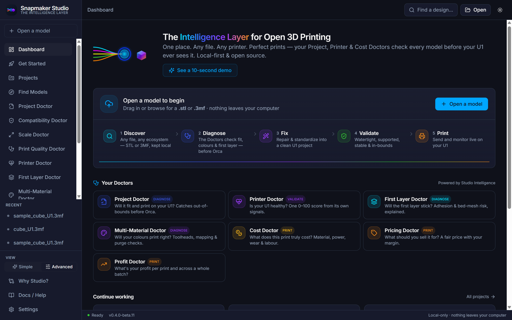
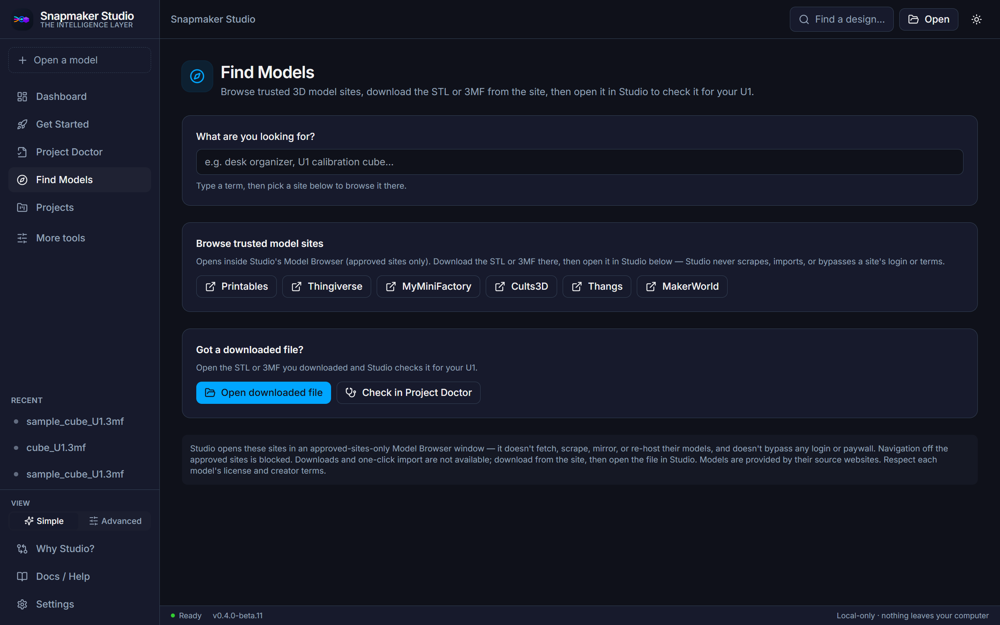
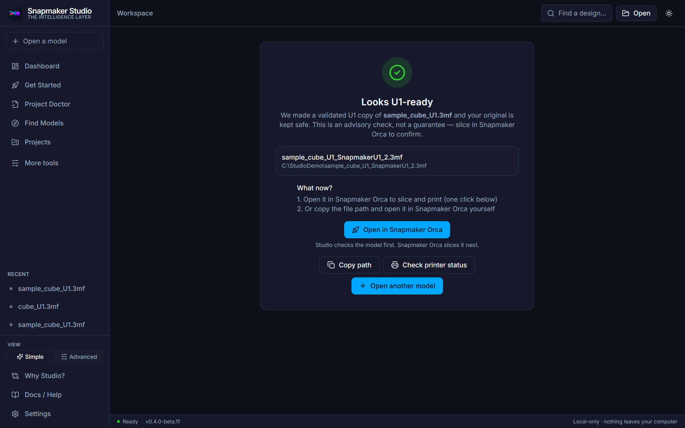
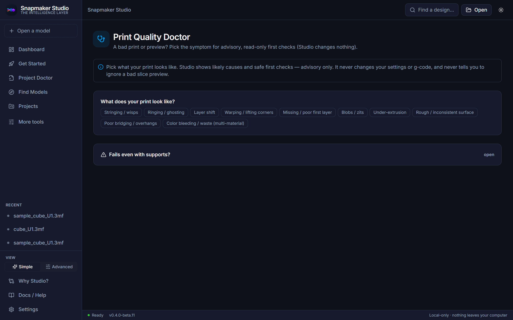

# Snapmaker Studio — Judge Overview (beta.12 — beta.11 completion)

> Independent open-source project — not affiliated with or endorsed by Snapmaker.
> "Snapmaker" is a trademark of its respective owner.

## 30-second summary

Snapmaker Studio is a local-first desktop app (plus a scriptable engine and CLI)
that reads the real geometry of a 3D design and walks it through the whole
pre-print workflow — understand, validate, prepare, monitor — before your U1 ever
sees the file. It is advisory: it surfaces likely print risks and explains why,
so you can decide what to fix before wasting filament. It does not slice and it
does not control the printer.

## Problem

Beginners on the Snapmaker U1 — especially with multicolor or support-heavy
prints — often discover problems only after a failed print: a model that isn't
watertight, won't fit the bed, tips over, or carries slicer settings that don't
map cleanly to the U1. The slicer assumes the file is already good. Nothing tells
the user, in plain language, what is likely to go wrong first.

## Solution

Studio reads the actual mesh and project metadata, then runs a set of read-only
"Doctors" that each report what was found, why it matters, and what to try. It can
also prepare a clean, print-ready copy without ever changing the original. The
output is a readiness estimate and concrete guidance — not a slice, and not a
promise.

## Why now

Open 3D printing has good slicers (Orca) and good monitors (Fluidd), but the
pre-print decision layer is missing. The U1's multicolor and support workflows
raise the cost of a bad print. A local-first, advisory layer that explains print
risk in plain language fills that gap without locking anyone into a cloud account.

## Target user

Snapmaker U1 owners, especially beginners working with multicolor or
support-heavy prints, who want to diagnose, prepare, troubleshoot, and estimate a
print before opening the slicer.

## beta.12 capabilities (completes beta.11)

- Plate Color Remap explains painted-per-face plates clearly (no dead "no base
  colors" state); shows the colour/plate preview of what changes vs stays.
- Print Quality Doctor adds bed-adhesion and support-failure paths (12 total).
- Known-good comparison opens with plain "compare a failed print with one that
  worked" framing.
- Tighter security: the desktop app now ships a Content-Security-Policy
  (verified: the app still reaches its local engine and controls).
- One-click "Open in Snapmaker Orca" — once a validated U1 copy is prepared,
  hand it straight to an installed Snapmaker Orca to slice (one-way handoff;
  Studio never slices or controls Orca). Falls back to "Install Snapmaker Orca"
  and "Copy path" when Orca isn't installed.
- Approved-site Model Browser v1 — browse trusted sites inside Studio's locked
  window; manual download/open only; no scraping, no auto-import, no API keys.
- Print Failure Troubleshooter — walks through likely causes when a print fails,
  including the "fails even with supports" path.
- Known-good print comparison — compare a problem file against a print that
  worked, to narrow down what changed.
- Scale Options Ladder — clear size options when a model doesn't fit or needs
  rescaling, one change at a time.
- Reliability hardening — steadier behavior across the read/validate/prepare flow.
- Local API hardening — tightened cross-origin handling on the local service.
- Library database migration scaffold — forward-compatible storage groundwork.
- API contract guard — a check that keeps the local API responses stable.

## How Studio differs from Orca and Fluidd

Studio is the pre-print intelligence layer, not a slicer or a controller. Orca
slices a model into machine instructions. Fluidd monitors and controls a running
printer. Studio sits before both: it reads the design's real geometry, estimates
readiness, surfaces likely risks with plain-language guidance, and prepares a
clean copy to hand to the slicer. The three are complementary — Studio decides
what to fix, Orca slices, Fluidd monitors, and the U1 prints.

## Safety and trust posture

Studio runs entirely on your machine — no cloud, no account, no upload. Originals
are never modified; preparation always produces a new copy. The monitoring view
is read-only. Findings are advisory readiness estimates with reasons, not
guarantees of print success. The Windows installer is not code-signed yet, so
SmartScreen may show "Unknown publisher" for this beta; downloads should be taken
only from the official release and verified by SHA256.

## Current limitations

- Advisory only — Studio estimates readiness and explains risk; it does not
  guarantee a print will succeed.
- Not a slicer and not a printer controller.
- Windows beta installer is not code-signed yet.
- Validated mostly on a real-world file corpus; coverage continues to grow.

## Next roadmap

- Broaden the file/source ecosystems Studio reads cleanly.
- Deeper troubleshooting paths and richer known-good comparison.
- Continued reliability hardening and expanded readiness checks.
- Windows code-signing ahead of any wider public launch.

## Visual walkthrough

Captured from the live beta.11 UI on a sample file. Full set in
[SCREENSHOTS_BETA11.md](SCREENSHOTS_BETA11.md).

## 5–7 minute demo flow

1. Open Studio and show the Dashboard with the available Doctors.
2. Open a U1 3MF file and let Studio read its real geometry.
3. Run the Scale Doctor and walk the Scale Options Ladder size options.
4. Open the Print Quality Doctor and show the "Fails even with supports" path.
5. Show the known-good troubleshooting mode comparing against a working print.
6. Show the Compatibility Doctor or Plate Color Remap.
7. Close on the point: Studio helps you decide what to fix before wasting
   filament.

See also: [DEMO_SCRIPT_BETA9.md](DEMO_SCRIPT_BETA9.md),
[WHAT_TO_TEST_FIRST.md](WHAT_TO_TEST_FIRST.md),
[windows-install.md](windows-install.md).
