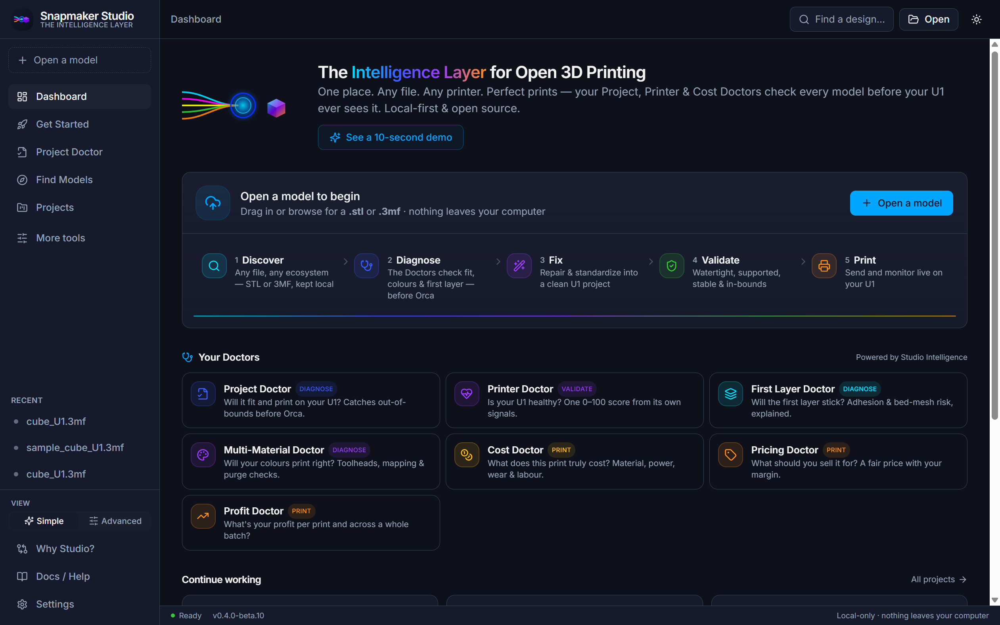
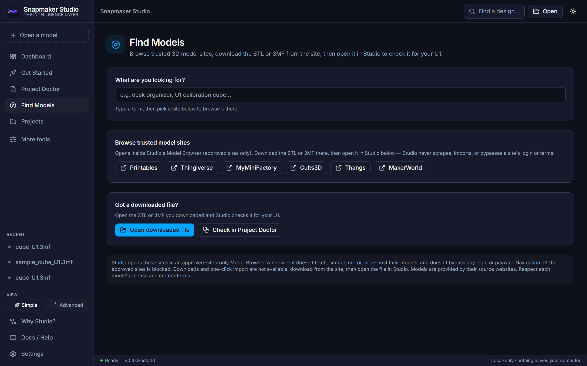
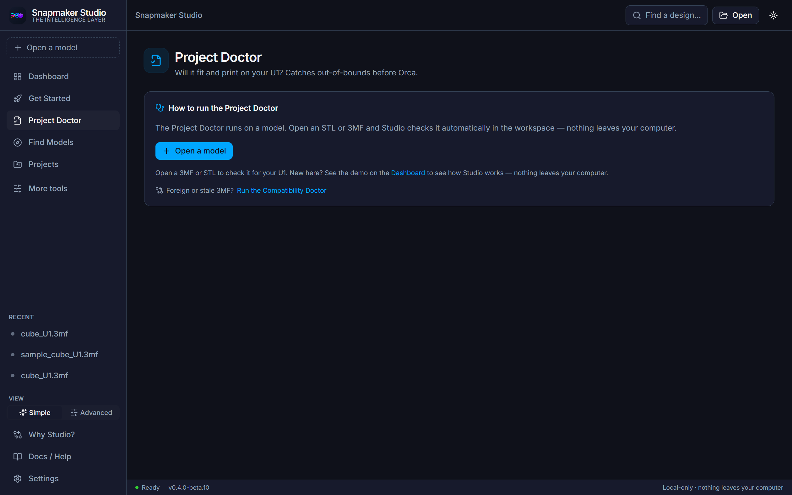
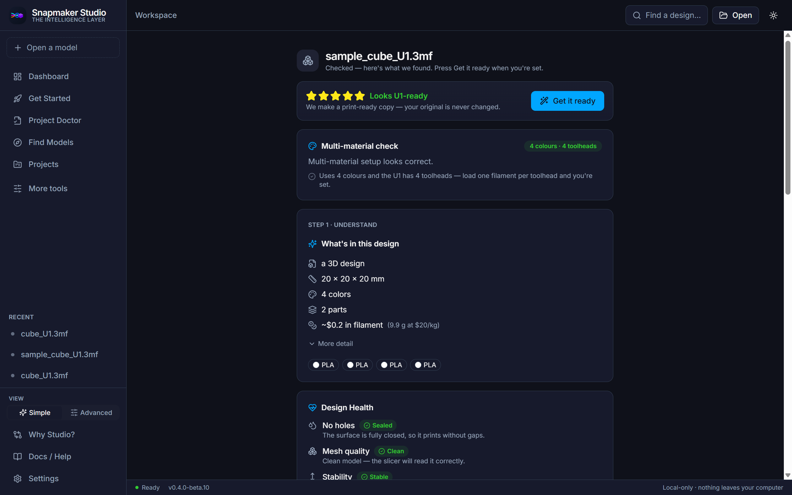
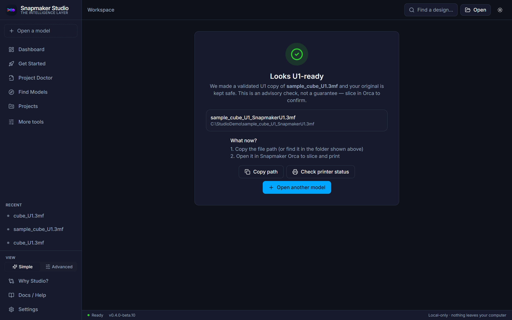
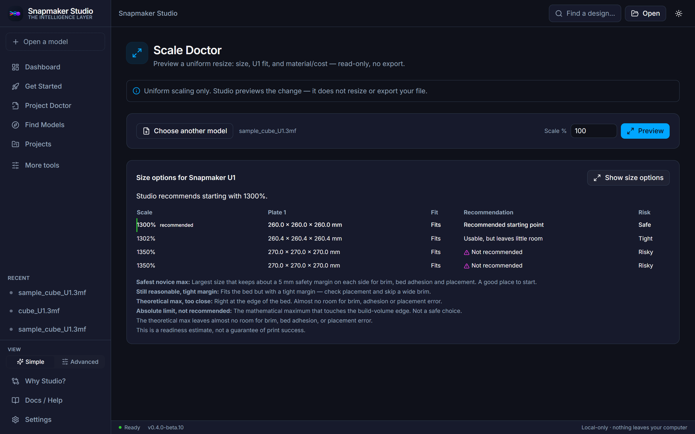
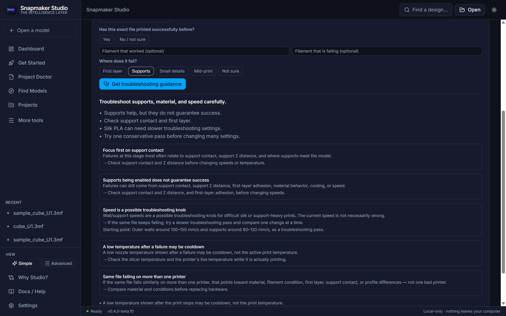
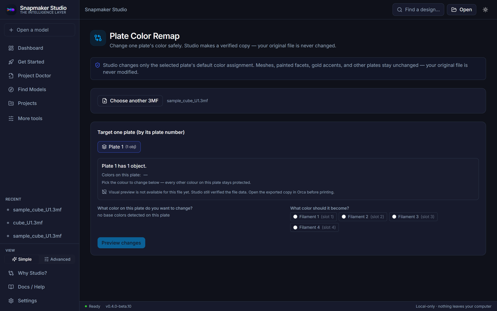

# Screenshots Checklist (beta.10)

Captured from the live beta.10 UI on a sample U1 3MF (`examples/sample_cube_U1.3mf`,
opened from a neutral demo folder so no private or commercial paths are shown).
Everything is local; nothing is uploaded.

> Independent open-source project — not affiliated with or endorsed by Snapmaker.

## Checklist

- [x] Dashboard — simplified navigation, the Doctors grid, and your local library. 
- [x] Find Models — beginner view: browse approved sites in Studio's locked Model Browser, then open the downloaded STL/3MF. Manual download only; Studio never scrapes or bypasses a login. 
- [x] Project Doctor — empty state: how to run it on a model. 
- [x] Project Doctor — result: Design Health on the real mesh (watertight, mesh quality, stability, supports, bed fit) plus cost/pricing/profit. 
- [x] Snapmaker Orca handoff — after a validated U1 copy is prepared; the original is kept safe and the copy is handed to Orca to slice. Advisory, not a guarantee. 
- [x] Scale Options Ladder — size options for the U1 with fit, recommendation, and risk levels; readiness estimate, not a guarantee. 
- [x] Print Quality Doctor — the "fails even with supports" path with known-good-aware troubleshooting guidance. Advisory; Studio never edits your slicer settings or g-code. 
- [x] Plate Color Remap — change one plate's color on a verified copy; meshes, painted facets, gold accents, and other plates stay protected, and the original is never modified. 

## Note on the in-app Model Browser

The Model Browser opens approved sites in a separate, locked Tauri window
(navigation off the allowlist is blocked; no scraping, no import, no login
bypass). It is a native window rather than part of the main app surface, so the
Find Models screenshot above is the canonical capture of that workflow — it shows
the approved-site entry points and the locked-browser explanation.

## Capture tips

- Use a sample file from `examples/`, not a private or commercial model.
- Keep window chrome clean; show one Doctor per shot where possible.
- Keep wording on screen advisory ("readiness estimate"), not a guarantee.
- Don't show private local paths; use a neutral demo folder for the sample file.

See also: [JUDGE_OVERVIEW.md](JUDGE_OVERVIEW.md),
[WHAT_TO_TEST_FIRST.md](WHAT_TO_TEST_FIRST.md).
