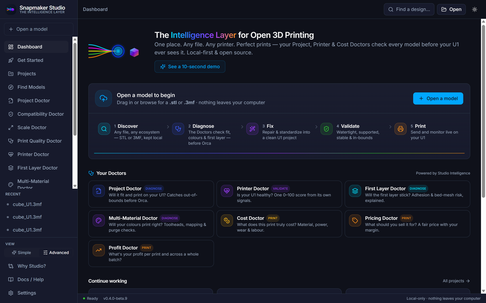
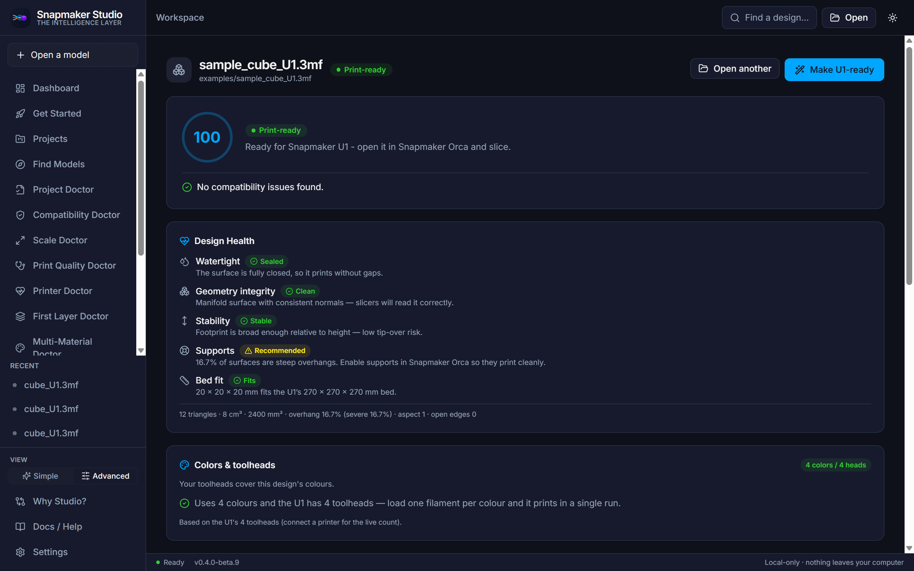
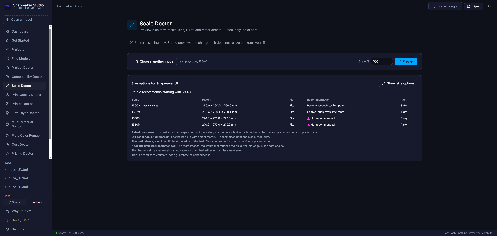
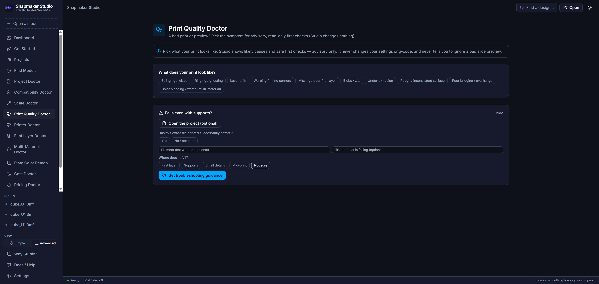
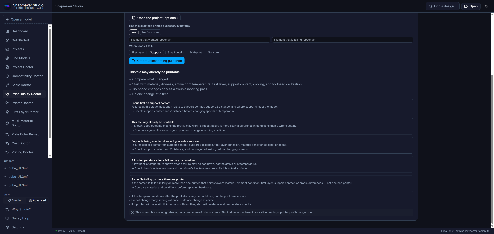
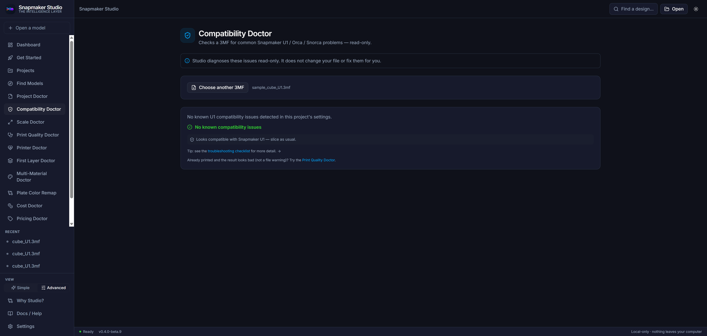
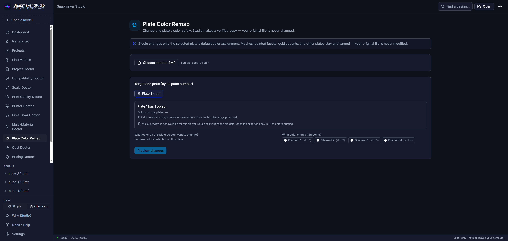
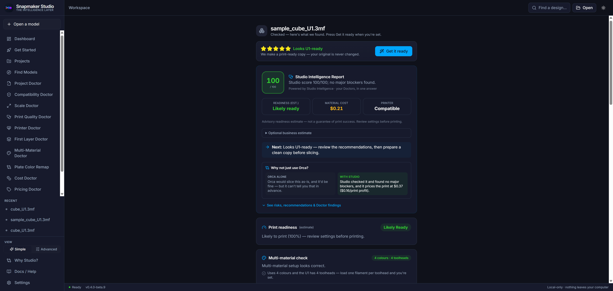
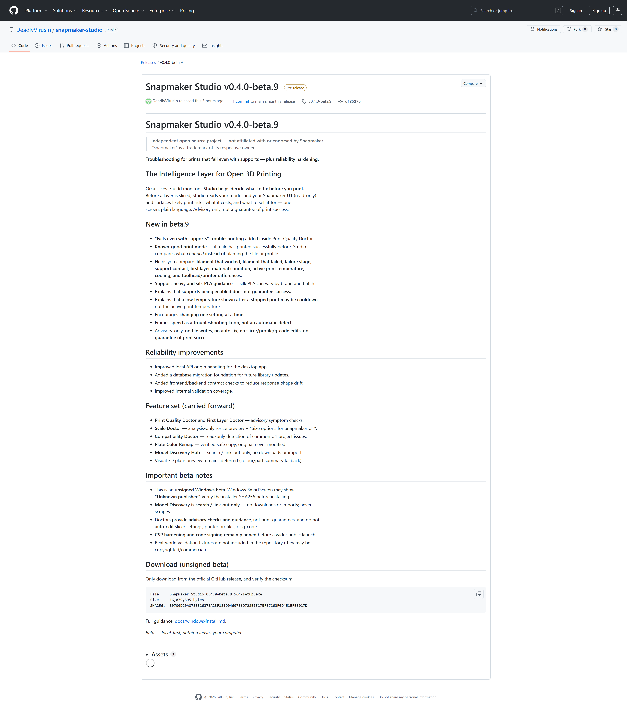

# Screenshots Checklist (ARCHIVED — beta.9, not current beta.10)

> **ARCHIVED — beta.9, not current beta.10.** These shots are from the beta.9 UI.
> The current set is in [SCREENSHOTS_BETA10.md](SCREENSHOTS_BETA10.md).

Capture these screenshots for the beta.10 judge/demo package. Use a sample U1 3MF
(see the repo's `examples/` folder) so no private or commercial model files are
shown. Everything is local; nothing is uploaded.

> Independent open-source project — not affiliated with or endorsed by Snapmaker.

## Checklist

All captured from the live beta.10 UI on a sample file (`examples/sample_cube_U1.3mf`).

- [x] Dashboard — the Doctors grid and your library, local-first. 
- [x] Project Doctor — Design Health on the real mesh: watertight, geometry, stability, supports, bed fit. 
- [x] Scale Options Ladder — size options for the U1 with fit and risk levels. 
- [x] Print Quality Doctor — the "fails even with supports" path. 
- [x] Known-good troubleshooting — guidance when the file printed before, one change at a time. 
- [x] Compatibility Doctor — read-only U1 / Orca readiness check. 
- [x] Plate Color Remap — change one plate's color on a verified copy; the original is never modified. 
- [x] Cost / Pricing / Profit — true cost, suggested price, and margin in the Studio Intelligence Report. 
- [x] GitHub release page — the v0.4.0-beta.10 release showing the installer asset and its SHA256. 

## Capture tips

- Use a sample file from `examples/`, not a private or commercial model.
- Keep window chrome clean; show one Doctor per shot where possible.
- For the release-page shot, make the asset name
  `Snapmaker.Studio_0.4.0-beta.10_x64-setup.exe` and the SHA256 both legible.
- Keep wording on screen advisory ("readiness estimate"), not a guarantee.

See also: [DEMO_SCRIPT_BETA9.md](DEMO_SCRIPT_BETA9.md),
[JUDGE_OVERVIEW.md](JUDGE_OVERVIEW.md).
