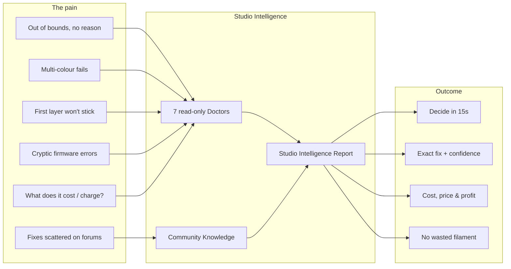

# Snapmaker Studio — Innovation Fund Readiness Scorecard

## Problem -> Solution infographic

## Final screenshot package (`docs/brand/shots/`)
| File | Shows |
|---|---|
| `dashboard_final.png` | Branded dashboard, Doctors first-class, Demo entry |
| `demo_report.png` | Studio Intelligence Report (demo) |
| `report_full.png` | Full Report: score, metrics, Expected Improvement, risks + community fixes, why-not-Orca |
| `why_studio.png` | Outcome comparison vs Orca & Fluidd |
| `before_dashboard.png` / `after_dashboard.png` | Brand evolution |

## 60-second demo flow audit
3 clicks for the entire narrative — no unnecessary steps:
1. **"See a 10-second demo"** (Dashboard) -> full Intelligence Report renders.
2. **"See risks & Doctor findings"** -> reveals a community fix.
3. **"Why Studio?"** -> positioning.
Every screen reinforces the Intelligence Layer narrative (sidebar mark + tagline on
all; "Powered by Studio Intelligence" on the Report; outcomes framing on Why Studio).
Demo Mode verified: `/demo_report` returns score 78 + Expected Improvement + 3
risks with community fixes; renders with no printer and no file.

## Scorecard

### Strengths
- **Unique value:** cost->pricing->profit + pre-slice out-of-bounds explanation +
  community-backed fixes — none of which Orca/Fluidd/OctoPrint do.
- **Instant comprehension:** one Report answers six questions in ~15s; full demo <60s.
- **Zero-setup demo:** works with no hardware/file — ideal for reviewers.
- **Engineering quality:** 166 tests green, clean build, RC smoke-tested, 0 orphans.
- **Trust posture:** local-first, read-only printer access, labelled estimates,
  no fabricated data, clear non-affiliation notice.
- **Brand:** cohesive frozen Intelligence Layer identity end-to-end.

### Risks
- **Live-hardware breadth** is lightly field-tested (mitigated: demo uses sample data).
- **Community Knowledge is a curated MVP**, not live-ingested (Phase 2 documented).
- **External validation pending** — kit ready, tester results not yet collected.
- **Per-file UI shots** require the desktop runtime (capture live in the recorded demo).

### Remaining gaps (non-blocking)
- Run the external tester round; fill the User Validation Report + testimonials.
- Optional: rebuild the installer to fold in the dead-code cleanup (cosmetic; the
  removed helper never ran).
- Optional: in-app FeedbackButton at the four capture points (post-freeze).

### Recommendation: **SUBMIT**
The product is demonstrable end-to-end with no hardware, the differentiation is
clear in under a minute, engineering quality is verified, and every gap is either
non-blocking or a post-submission improvement. Recommend submitting now and running
the tester round in parallel to attach testimonials to the application.
