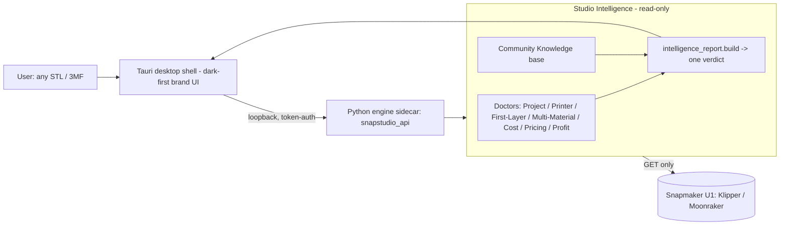

# Snapmaker Studio — Innovation Fund Submission

> **Independent open-source project — not affiliated with or endorsed by Snapmaker.**
> "Snapmaker" is a trademark of its respective owner.

## Product overview
Snapmaker Studio is **the Intelligence Layer for open 3D printing** — a local-first
desktop companion for the Snapmaker U1. It reads any model (STL / 3MF, including
foreign Bambu/Orca projects), and before a single layer is sliced it answers the
six questions a maker actually has, in one screen:

1. **Will it print?** 2. **What will it cost?** 3. **What should I sell it for?**
4. **What's my profit?** 5. **What's the biggest risk?** 6. **What do I do next?**

It does this through **Studio Intelligence** — a set of read-only "Doctors"
(Project, Printer, First Layer, Multi-Material, Cost, Pricing, Profit) whose
findings are synthesised into a single **Studio Intelligence Report**.

## Problem statement
Open 3D printing on the U1 is powerful but unforgiving. The slicer (Snapmaker Orca)
tells you a job failed — "out of bounds" — but not *why* or *how to fix it*. The
printer host (Fluidd) shows raw telemetry, not judgement. Cost and selling-price
are left to spreadsheets. New owners burn filament, hours, and goodwill on prints
that were never going to work, and the fixes live scattered across Facebook groups,
Reddit, and GitHub issues. **There is no layer that decides, explains, and prices —
before you print.**

## Why Studio exists
Orca slices. Fluidd monitors. Neither *judges a model against your specific printer
and your business goals*. Studio fills that gap: a printer-aware, business-aware
intelligence layer that turns scattered community know-how and raw printer data
into one plain-language verdict a novice understands in 15 seconds — entirely
local-first and open-source, true to the U1's open Klipper/Moonraker ethos.

## Competitive positioning (outcomes, not features)
| The question a maker asks | OrcaSlicer | Fluidd | **Studio** |
|---|---|---|---|
| Will it print — before I slice? | Slices, then errors | No model analysis | **Project Doctor verdict** |
| Why won't it slice (and the fix)? | "Out of bounds", no reason | — | **Cause + exact fix** |
| What will it cost to make? | Grams + time only | — | **Cost Doctor** |
| What should I sell it for / profit? | — | — | **Pricing + Profit Doctor** |
| Is my printer healthy? | — | Raw telemetry | **0–100 health score** |
| What's the community's fix? | — | — | **Built-in, per risk** |
| One clear answer in 15s? | Read the gcode | Read the dials | **Intelligence Report** |

Studio is **complementary, not competitive** — it sits above the slicer and host,
and hands a clean, validated project to Orca.

## Innovation narrative
The novel contribution is **synthesis**: not another slicer or telemetry viewer,
but an intelligence layer that (a) reads the U1's own open Moonraker metadata and
geometry, (b) runs specialised read-only analyses, (c) folds them into a single
score + money headline + biggest-risk + next-action, and (d) attaches the
community's known fix to each risk with a confidence level and an *Expected
Improvement* estimate. No tool in the U1 ecosystem does cost→pricing→profit
intelligence, pre-slice out-of-bounds explanation, or community-knowledge-backed
fixes. This expands the Snapmaker ecosystem by making the open U1 approachable to
first-time and business users.

## Screenshots (`docs/brand/shots/`)
- `dashboard_final.png` — branded dashboard, Doctors as first-class, Demo entry.
- `demo_report.png` / `report_full.png` — the Studio Intelligence Report: score,
  five headline metrics, Expected Improvement, biggest risk, next action,
  "why not Orca?", and per-risk community fixes.
- `why_studio.png` — outcome-based positioning vs Orca & Fluidd.
- `before_dashboard.png` / `after_dashboard.png` — brand evolution.

## Architecture

- **Local-first:** nothing leaves the machine; the engine is a loopback sidecar.
- **Read-only printer access:** GET-only Moonraker — never writes or starts prints.
- **Honest by design:** every estimate is labelled; unavailable signals are skipped,
  never fabricated.

## Status
v0.4.0-beta.1 release candidate built and smoke-tested (installer + frozen engine).
166 automated tests green. See `RELEASE_READINESS.md` and `AUDIT.md`.
