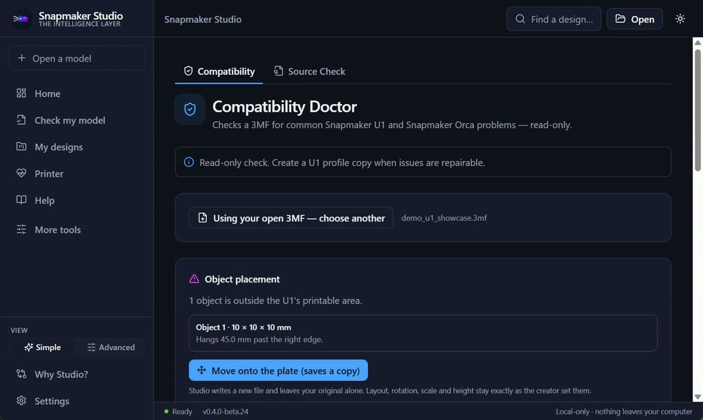

# Snapmaker Studio — judge overview

Five minutes, from a standing start. If you only read one page about this project,
read this one.

> Independent open-source project — not affiliated with or endorsed by Snapmaker.
> "Snapmaker" is a trademark of its respective owner.

**If you arrived from the Innovation Fund project wall:** the card there was
written from the entry submitted on 24 June 2026 and describes the project as it
was then. Everything under "The hard problem" and "What is verified" below shipped
after it. The June text is kept verbatim in
[SUBMITTED_ENTRY.md](SUBMITTED_ENTRY.md) so the difference is auditable rather
than asserted.

## What it is

**Snapmaker Studio — The Intelligence Layer for Open 3D Printing.**

A local-first desktop application that sits between "I downloaded a project" and
"I opened the slicer". It reads the project's real contents, compares them against
the printer it can see on the network, fixes only what it can justify in a new
copy, accounts for what changed, and names the community tool that should handle
the next step.

**Studio does not slice.** Snapmaker Orca slices. That is a hard rule in the
codebase, not a roadmap item.

## Watch it work

[52 seconds, recorded from the installed application](https://github.com/DeadlyVirusIn/snapmaker-studio/blob/main/docs/media/snapmaker-studio-demo.mp4).
Nothing staged, nothing re-created. No printer is connected in the recording, so
it also shows what Studio says when it cannot reach one — which is the more
interesting half. The beat-by-beat script is
[DEMO_SCRIPT_90_SECONDS.md](DEMO_SCRIPT_90_SECONDS.md).

## The story, in one screen

1. A beginner downloads a project. It was made elsewhere, for another printer.
2. **Studio understands the file** — its real contents, not its filename.
3. **Studio explains the risks** in plain language, each with the evidence that
   proved it and how confident it is.
4. **Studio compares the project with the actual printer** — materials against
   toolheads, materials against what is *loaded*, objects against the real bed,
   required capabilities against the firmware's own object list.
5. **Studio fixes only what it can justify**, in a new copy. The original is never
   modified.
6. **Studio proves what changed and what survived**, element by element.
7. **Studio names the open-ecosystem tool** for the next step.
8. **Snapmaker Orca slices.**

## The hard problem

Not the fixing. Being correct when the file or the printer does not expose enough
information to be certain — and saying so, rather than guessing in the direction
that looks better.

Every fact Studio states carries its source and one of four confidence levels.
An unmeasured trait is unknown, never false. **"Not detected" is never rendered as
"not supported"**, and that wording is asserted by tests over every unknown the
code can produce.

The clearest example: stock U1 firmware does not report which nozzle is fitted.
Studio says *"Nozzle size — check this yourself"*, explains what a mismatch would
do, and stops. Verified against real hardware in beta.24 — the firmware genuinely
does not expose it.

The second clearest: multi-plate repositioning was built, reviewed, and
**withdrawn**. Plate spacing is not recorded in a project file; a review reproduced
a case where the feature placed a plate off the bed while reporting success. The
honest fix was to remove it, not to tune a number Studio cannot observe.

## What is verified, and how

Everything below ran against the **published beta.24 installer** — installed,
launched, driven through the real window, then uninstalled. Not a development
server, not the source tree.

| What | Result | How to reproduce |
|---|---|---|
| Installed-application acceptance | **21/21** | `pwsh -File tools/acceptance/run.ps1` |
| Read-only verification against a real Snapmaker U1 | **13/13** | `pwsh -File tools/hardware/verify.ps1 -PrinterHost <ip>` |
| End-to-end pipeline self-check | **15/15** | `u1convert selfcheck` |
| Genuine OrcaSlicer / BambuStudio / PrusaSlicer projects | **34 tests** | `pytest tests/test_real_world_3mf.py` |
| Backend | 663 passed, 3 skipped | `pytest` |
| Desktop | 247 passed, 31 files | `npm run test` |
| TypeScript · production build · Rust | clean | `tsc --noEmit` · `npm run build` · `cargo check` |

Full records, including the raw evidence files:
[../TRUST_STATUS.md](../TRUST_STATUS.md). Step-by-step:
[JUDGE_WALKTHROUGH.md](JUDGE_WALKTHROUGH.md).

The hardware run was read-only by construction: the allowed routes are asserted
against a deny-list before the first request. Nothing was started, uploaded or
queued; no temperature, motion, homing, pause, resume, cancel, emergency-stop or
configuration call was made.

## Why the U1 specifically

Snapmaker publishes the U1's firmware and ships the standard Klipper/Moonraker
stack, so a local application can ask the machine what it can actually do instead
of inferring it from a model name. Studio is a direct beneficiary of that
openness, and the comparison it performs is not possible on a closed printer.

## Openness

MIT. No account, no cloud, no telemetry, nothing uploaded. A documented CLI and a
documented local HTTP API, so the engine is usable without the app. The ecosystem
registry is a data file — adding a tool is a small pull request, and a test proves
every entry is reachable. AGPL and GPL neighbours are interoperated with, never
vendored; every one is listed with its licence in
[../../THIRD_PARTY_NOTICES.md](../../THIRD_PARTY_NOTICES.md).

## What this is not

- Not a slicer, and it will not become one.
- Not a printer dashboard. Fluidd already ships on the U1 and Studio does not
  replace it; Printer Hub answers a different question — *is this printer ready
  for this specific project?*
- Not a converter. A converter reports one word: converted.
- Not a guarantee. Every check is advisory, and a project that passes them all can
  still fail on the plate.
- Not autonomous. Studio never starts, heats, moves or homes a printer on its own.

## Where the project is weak

One star. No issues ever opened. Forty-three installer downloads and no evidence
of what happened after any of them. The measured figures, and what they do and do
not support, are in [USER_EVIDENCE.md](USER_EVIDENCE.md) — separated into interest
and outcome, with the second still empty.

The installer is unsigned. SmartScreen will show an unknown publisher; verify the
SHA256 before running it. Why, and what is being done:
[../CODE_SIGNING_POLICY.md](../CODE_SIGNING_POLICY.md).

## Where to go next

| | |
|---|---|
| The submission itself | [../INNOVATION_FUND.md](../INNOVATION_FUND.md) |
| Reproduce the claims | [JUDGE_WALKTHROUGH.md](JUDGE_WALKTHROUGH.md) |
| Technical depth | [TECHNICAL_DEPTH.md](TECHNICAL_DEPTH.md) |
| Where Studio sits in the field | [COMPETITOR_MATRIX.md](COMPETITOR_MATRIX.md) · [DIFFERENTIATION_STRATEGY.md](DIFFERENTIATION_STRATEGY.md) |
| The ecosystem story | [OPEN_ECOSYSTEM.md](OPEN_ECOSYSTEM.md) |
| Download | [Releases](https://github.com/DeadlyVirusIn/snapmaker-studio/releases/tag/v0.4.0-beta.24) · hash in [../RELEASE_METADATA.md](../RELEASE_METADATA.md) |
